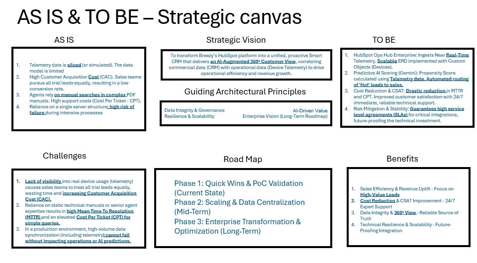
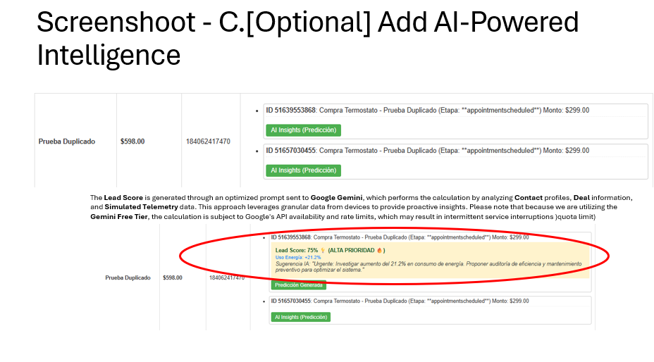
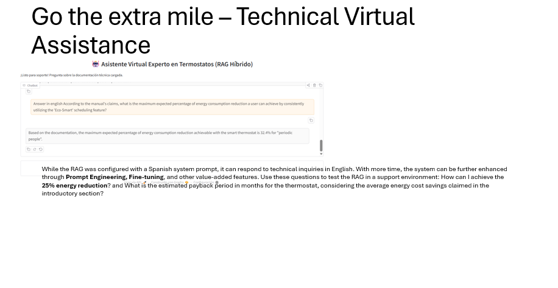
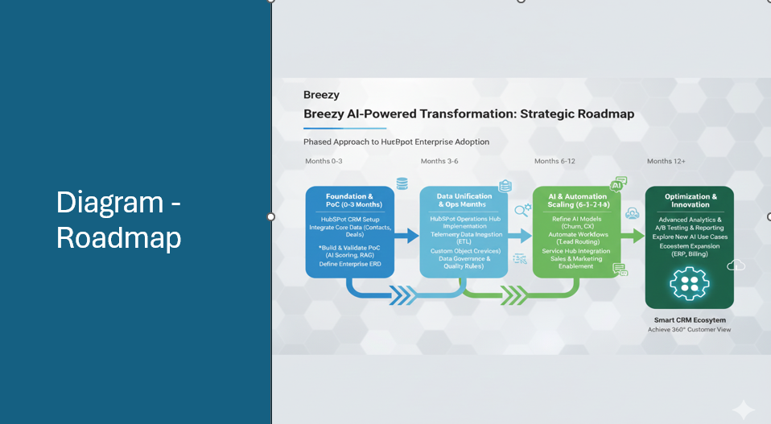

# 🚀 Omar Darío Díaz Hernández | Senior AI & Data Solutions Leader
**CTO | Presales Specialist | Master in AI Candidate (Universidad de los Andes)**

IT Strategy Leader with over **20 years of experience** designing and monetizing transformative AI/ML and GenAI architectures across LATAM. My focus bridges the gap between high-level C-Suite consulting and deep technical implementation in supervised, unsupervised, and foundation models.

---

## 🛠️ Technical Stack

* **AI & Deep Learning:** PyTorch, TensorFlow, Scikit-learn, MONAI, LangChain, NVIDIA AI Enterprise.
* **Computer Vision:** CNNs, ResNet, Vision Transformers (ViT), Segment Anything Model (SAM).
* **NLP:** Transformers (BERT/DistilBERT), LLMs, RAG, LSTM/GRU, Semantic Analysis (LSA/SVD).
* **Cloud & Architecture:** Google Cloud (Certified), Azure, AWS, SQL, NoSQL (Cassandra).

---

## 🏛️ Strategic AI & CRM Transformation: Case "Project Breezy"

### 💨 [Enterprise Data Monetization & Customer Lifecycle PoC](https://github.com/omardiazh2013/HubSpotTechnicalAssessment)
**Role:** External Strategic Consultant | **Tech Stack:** Gemini AI (Vertex AI), RAG Architecture, Python, Enterprise CRM Integration.

> **Executive Summary:** Led a consultative digital transformation for a major thermostat manufacturer to monetize siloed telemetry data. I bridged the gap between millions of IoT devices and commercial operations, shifting the business model from "Hardware-Sales" to **"Energy Efficiency as a Service."**

#### 🔍 The Consultative Approach (Methodology)
* **The Challenge (Situation/Task):** The client struggled with high Customer Acquisition Costs (CAC) and siloed data. Millions of connected devices were generating telemetry that wasn't being used to drive sales or improve support. 
* **The Strategy (Action):** Conducted a **Discovery Workshop (As-Is / To-Be)** to map pain points. Designed a **Strategic Canvas** to unify IoT telemetry with CRM data, creating a "Single Source of Truth."

  

#### 🛠️ AI-Driven Solutions & Implementation
* **Predictive Lead Scoring:** Implemented **Gemini-powered models** to calculate "Propensity to Buy" scores based on real-time device usage, allowing sales teams to prioritize high-value leads.

  

* **Intelligent Support Automation:** Developed a **RAG (Retrieval-Augmented Generation)** virtual assistant to automate technical support, reducing MTTR (Mean Time to Resolution) and shifting the cost center to a value driver.

  

#### 📈 Business Impact (Results)
* **ROI Driven:** Demonstrated a clear path to reduce the sales cycle and improve CSAT.
* **Strategic Alignment:** Transformed raw data into a new revenue stream, proving that an AI & Data stack is the ultimate engine for business maturity.

  

[👉 Explore the Technical PoC & Documentation](https://github.com/omardiazh2013/HubSpotTechnicalAssessment)

## 🌟 Featured Projects

### 🧠 Computer Vision & Healthcare
* **[Brain Tumor Classification (MRI)](https://github.com/omardiazh2013/Master-AI-Portafolio/blob/main/04_Deep_Learning/Microproyecto%20%23%201%20DL/Microproyecto1-CNN-fundacional_model2.ipynb):** Engineered a diagnostic system comparing a **CNN "from scratch"** against foundation models using the **MONAI framework**. Focused on distinguishing between Glioma, Meningioma, and Pituitary tumors to reduce clinical diagnostic errors.
* **[Segment Anything Model (SAM) Benchmark](https://github.com/omardiazh2013/Master-AI-Portafolio/blob/main/07_Visi%C3%B3n_Artificial%20-%20Interpretaci%C3%B3n%20visual/Segment_Anything_Model_SAM.ipynb):** Conducted sensitivity analysis and Zero-Shot benchmarking on Meta’s SAM. Optimized hyperparameters like `points_per_side` and `stability_score` to improve **Average Recall (AR@300)** by 10% on the LVIS dataset.

* **[Vision Transformers (ViT) from Scratch](https://github.com/omardiazh2013/Master-AI-Portafolio/blob/main/07_Visi%C3%B3n_Artificial%20-%20Interpretaci%C3%B3n%20visual/Laboratorio_VisionTransformers.ipynb):** Implemented the full ViT architecture (Patch Embedding, MHSA, Positional Encoding) to process images as sequences, demonstrating proficiency in the latest attention-based vision paradigms.

### 🌿 NLP & Language Modeling
* **[BBC News Multi-Label Classification](https://github.com/omardiazh2013/Master-AI-Portafolio/blob/main/04_Deep_Learning/Microproyecto%20%23%203%20DL/DisTilBert_V_2_1.ipynb):** Leveraged **DistilBERT** to categorize massive news volumes. Achieved high-performance results while optimizing for computational efficiency and inference speed.
* **[Sentiment Analysis with RNNs](https://github.com/omardiazh2013/Master-AI-Portafolio/blob/main/04_Deep_Learning/Microproyecto%20%232%20DL/GRU_optimizado_V_1_0.ipynb):** Developed a comparative study between **LSTM and GRU** architectures for sentiment polarity detection, achieving **86.3% accuracy** and identifying optimal use cases for low-latency environments.

### 📈 Predictive Modeling & RL
* **[Smart City: Bike-Sharing Demand](https://github.com/omardiazh2013/Master-AI-Portafolio/blob/main/Proyectos%20ML/Etapa1delproyectomodelospolinomialesyregularizadosSegundoIntento.ipynb):** Built a high-precision regression pipeline (Lasso + Polynomial Degree-3) that identified key demand drivers, enabling a **12% improvement in operational readiness**.
* **[Reinforcement Learning: Maze Solver](https://github.com/omardiazh2013/Master-AI-Portafolio/blob/main/05_Aprendizaje_Refuerzo/Proyecto%20Aprendizaje%20por%20Refuerzo/Proyecto_Final_Q_Learning_V_3_0.ipynb):** Designed a Q-Learning agent within a custom Gridworld environment (8x7) to find optimal paths, implementing reward functions and state-action policies from the ground up.

---

## 💼 Executive Leadership & Strategy

* **Dell Technology Services:** Spearheaded AI project closures worth **$1.5M USD** and built a **$4M USD** pipeline in Data & AI practices.
* **Atos:** Led Big Data & Analytics strategy for the Andean region, rescuing critical projects and expanding portfolios through advanced analytical models.
* **BT LATAM:** Designed complex Data Center and Cloud architectures (IaaS, PaaS, SaaS) for strategic clients like Ecopetrol.

---

## 🎓 Education & Certifications

* **Master in Artificial Intelligence (MAIA)** - Universidad de los Andes (Candidate).
* **Harvard Digital Leader** Certification.
* **Google Certified Cloud Engineer**.
* **NVIDIA Certified:** Generative AI and LLMs.

---

## 📫 Let's Connect
I am passionate about how cutting-edge technology enables organizations to achieve strategic business objectives. If you are looking for a leader who understands **Business ROI** as deeply as **Neural Network Gradients**, let's talk!

---# Master-AI-Portafolio
